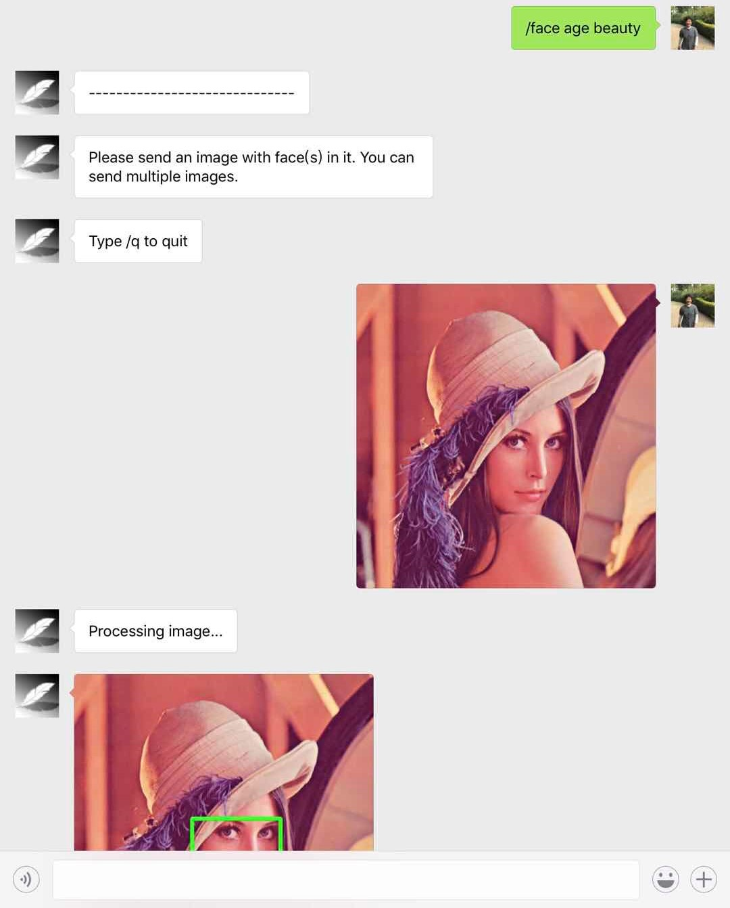
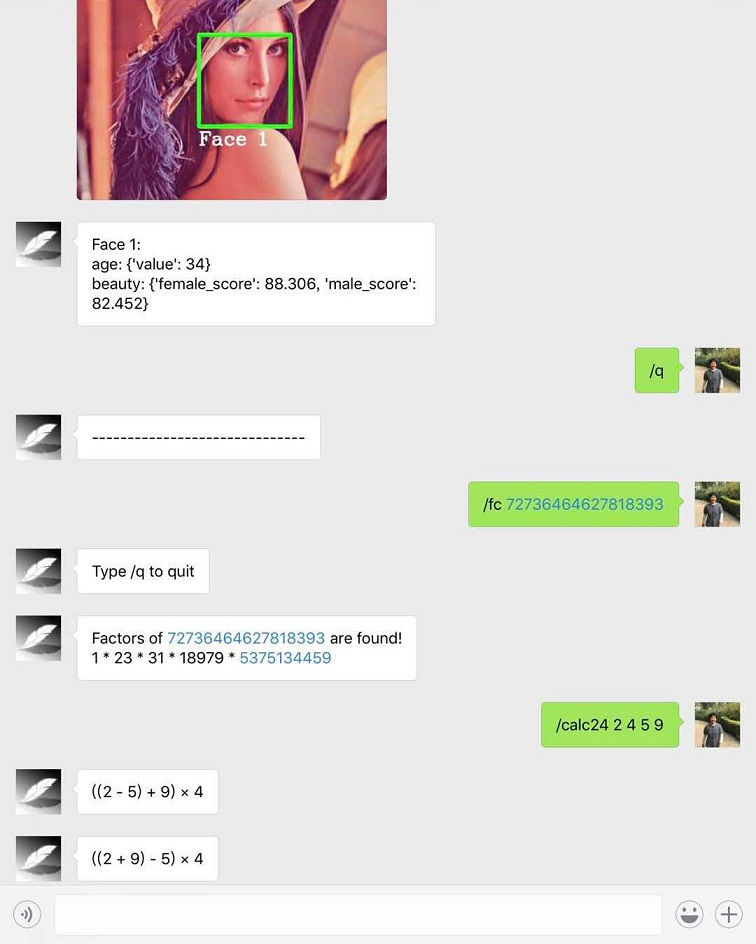

## WeChat Command-Line Tool
#### Execute main.py, scan the QR code to login, then you are good to go

You may need to get Tuling Chatbot API key and Face++ API key if you want to use Tuling.py and FaceAnalysis.py

After you've acquired these keys, create the "\_\_secrets__.py" file in modules folder and add your API keys
```python
facepp_keys = ["Key1", "Key2", "..."]
facepp_secrets = ["Secret1", "Secret2", "..."]
tuling_keys = ["Key1", "Key2", "..."]
```
If you want to write your own command-line module, please refer to "\_\_templates__.py" for details.

#### Dependencies:
##### python 3 (required)
##### itchat (required)
##### numpy (required)
##### Pillow (required)
##### numba (optional)
##### primesieve (pyprimes must be installed if missing)
Opitonal modules are recommended to be installed because they can significantly the improve performance.

### Demo




